# Clothing Store Console

Cette application de gestion de magasin de vêtement à pour but de faciliter la gestion des articles,des ventes et des clients.

## 1) Installation

Il vous suffit simplement de pull le repo git et de modifier le fichier hibernate.properties pour mettre dans les champs vides vos information de base de données

## 2) Utilisation

Après avoir lancer l'application il vous suffit de run le fichier main pour utiliser l'IHM faite pour l'application, si tout c'est bien passé vous devriez avoir cet affichage dans la console

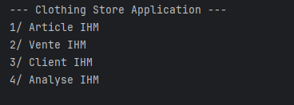

## 3) Section Article 
Via la section Article de l'IHM vous obtiendrez cinq choix possible.

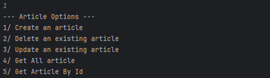

### 3.1) Création d'article
Si vous faites le choix 1 vous n'avez qu'a remplir les differénts champs qui vous seront demandé afin de créer votre premier article dans la base de données

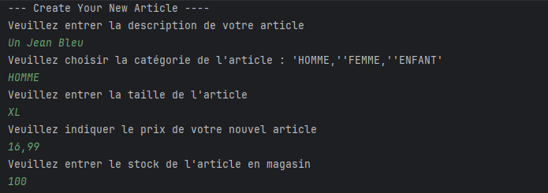

Vue sur la BDD

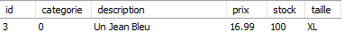

### 3.2) Suppresion d'un article
Si vous souhaiter supprimer un article vous n'avez qu'a choisir l'option 2

Ainsi vous n'aurez qu'a entrer l'id de l'article que vous souhaiter supprimer et il sera supprimer de la base de données

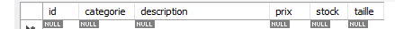

### 3.3) Modification d'un article
Si vous voulez Modifier un article l'option 3 est faite pour vous il vous suffira de suivre les étapes pour modifier l'article de votre choix et si vous ne souhaitez pas changer certains champ de l'article vous n'avez qu'a laisser le champ vide ou le mettre à 0 lorsqu'il s'agit d'une valeur numérique

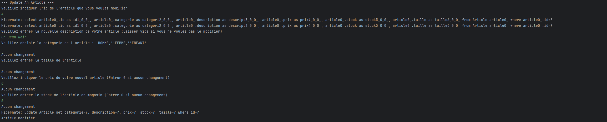

Comme on peux le voir la seule modification est la description est sur la base de données seul la description à changer et non les autre champs

### 3.4) Recuperation
Les options 4 et 5 sont similaire le seul changement et que l'option 5 permets de récupérer uniquement l'article que vous souhaiter via son id

## 4) Les Ventes
Si vous souhaiter accéder aux ventes il vous suffit d'entrer le choix 2 sur l'IHM de départ ce qui vous donnera ce menu 
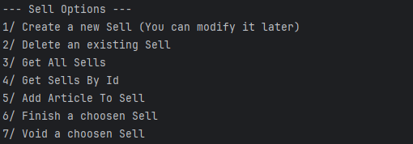
### 4.1) Creation de vente 

Comme pour l'article il vous suffira de suivres les indications pour créer une vente

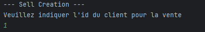

### 4.2) Suppresion de vente

L'option 2 vous demandera de saisir un id pour pouvoir supprimer la vente affilié 
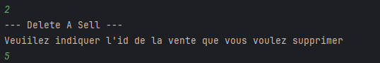

Et sur la base de donnée ne nous pouvons plus accéder à cette vente 

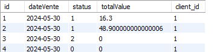

### 4.3) Récuperation de toutes les ventes 

L'option 3 vous retournera toutes les ventes existante 
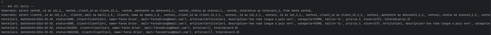

### 4.4) Récupération d'une vente via son id

L'option 4 vous demandera un id et vous retournera la vente qui possède cet ID 

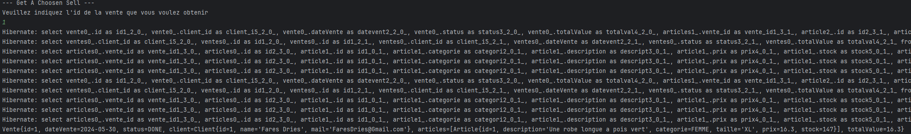

### 4.5) Ajout d'un ou plusieurs article sur notre vente

Ici dans le cas de notre simulation une vente est créer sans article et on en ajoute via l'option 5 de notre IHM comme lorsque qu'un caissier our une caissière scan nos article

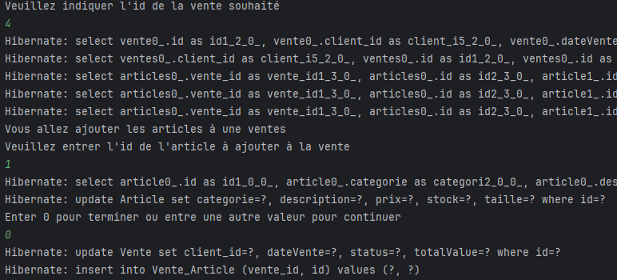

Bien sur il est possible d'ajouter des articles tant qu'il sont en stock et que la vente existence et n'est pas terminer et si nous affichons la vente à l'id 4 nous aurons bien l'article à l'id 1 présent 

### 4.6) Terminer une vente
L'option 6 permet de passer une vente en terminer ce qui lui donne un prix final et empêche les autre modifications

### 4.7) Annuler une vente
Dans le cas d'une annulation de vente l'option 7 permet de lui indiquer une vente qui est annulé ce qui empêche les modification ou la validation future

## 5) Gestion de client 

L'option 3 de notre IHM de base vous permet d'accéder au menu de gestion de client

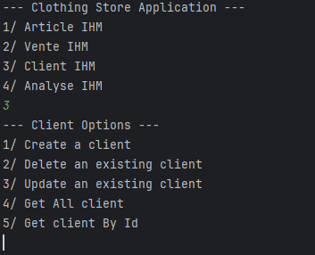

### 5.1) Ajout d'un client

Bien sur il nous faut des clients pour avoir un magasin fonctionnel, l'option 1 permet de créer des clients via un formulaire

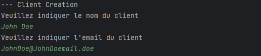

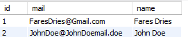

Ainsi sur notre base de données notre John Doe est présent

### 5.2) Suppresion de client

Si un client souhaite se désabonner de notre magasin il suffira de le supprimer de notre registre via l'option 2

### 5.3) Modification d'un client

Si le client change de mail ou de nom il est possible de modifier les informations enregistrées via l'option 3 

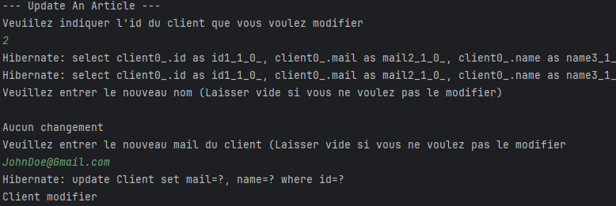

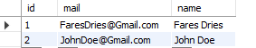

### 5.4) Récupération des clients

L'option 4 nous retourne tout nos client ainsi que leur ventes et l'option 5 nous retourne uniquement le client ainsi que ses ventes avec l'id qui est saisie par l'utilisateur

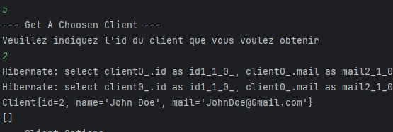

## 6) Section Analyse
L'option 4 de notre IHM nous permets d'obtenir des rapport sur les ventes ou le stock du magasin

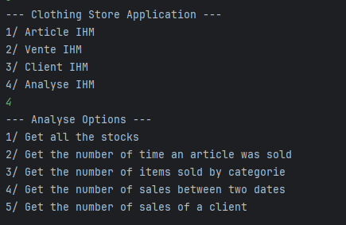

### 6.1) Récupération des stocks

L'option 1 nous retourne l'id des produits ainsi que la quantité de chaque article en stock

### 6.2) Combien de fois vendu ? 

Si nous voulons savoir si un article est bien vendu il suffit de choisir l'option 2 

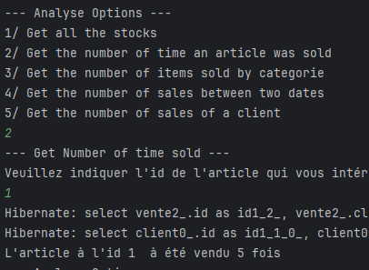

### 6.3) Savoir le nombre de ventes par catégorie

L'option 3 nous permets de savoir si une catégorie de produits est bien vendue 
Ici 5 produit sur les 6 sont de la catégorie des produits destinées au femme ce qui donne bien 83.3% des ventes 

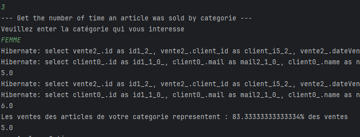

### 6.4) Nombre de ventes entre deux dates

L'option 4 nous permets donc de savoir si une période à eu beaucoup de vente 

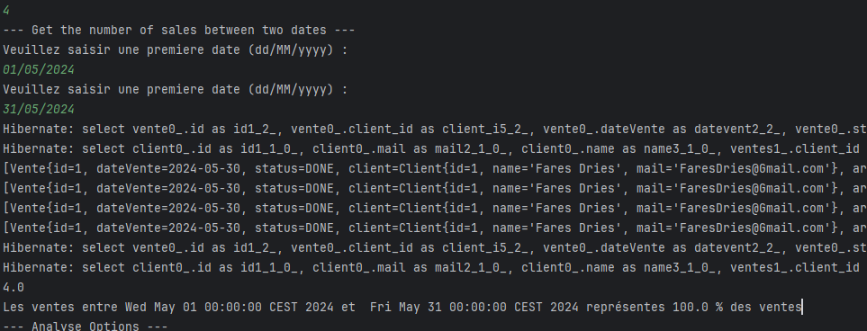

Comme on peut le voir entre le premier et le 31 Mai 100% de nos ventes ont été effectués durant cette période

### 6.5) Nombre de vente d'un client

Cette option nous permets donc de savoir si un client à effectué une ou plusieurs ventes

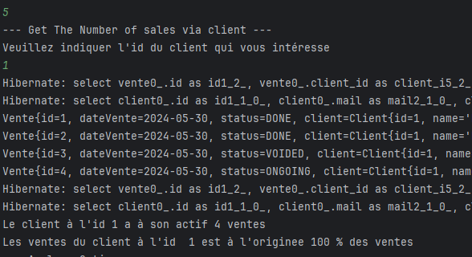

Comme on peut le voir le client à l'id 1 est à l'origine de 100 % des ventes on peut dire que c'est un clien fidèle

## Contribuation

Les pulls sont encouragés et si vous avez la moindre question je suis joignable sur mon mail : faresdries@Gmail.com

## License

[MIT](https://choosealicense.com/licenses/mit/)